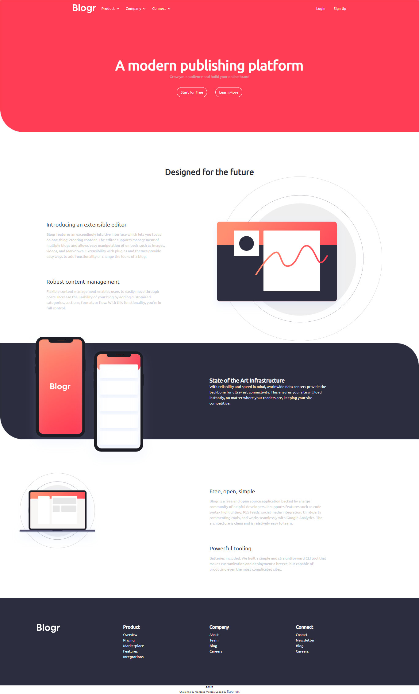

# Frontend Mentor - Manage landing page solution

This is a solution to the [Manage landing page challenge on Frontend Mentor](https://www.frontendmentor.io/challenges/manage-landing-page-SLXqC6P5). Frontend Mentor challenges help you improve your coding skills by building realistic projects. 

## Table of contents

- [Overview](#overview)
  - [The challenge](#the-challenge)
  - [Screenshot](#screenshot)
  - [Links](#links)
- [My process](#my-process)
  - [Built with](#built-with)
  - [Continued development](#continued-development)
  - [Useful resources](#useful-resources)
- [Author](#author)
- [Acknowledgments](#acknowledgments)

## Overview

### The challenge

Users should be able to:

- View the optimal layout for the site depending on their device's screen size
- See hover states for all interactive elements on the page
- See all testimonials in a horizontal slider
- Receive an error message when the newsletter sign up `form` is submitted if:
  - The `input` field is empty
  - The email address is not formatted correctly

### Screenshot

## My process

### Built with

- Semantic HTML5 markup
- CSS custom properties
- tailwindcss

### Useful resources

- [ resource 1](https://youtu.be/dFgzHOX84xQ) - This helped me for build this projext. I really liked his pattern and it has helped me, improve my tailwind skilss.
## Author

- Website - [stephen](https://github.com/Oghenekparobo)
- Frontend Mentor - [Oghenekparobo](https://www.frontendmentor.io/profile/Oghenekparobo)
- Twitter - [stephenjyd](https://twitter.com/stephenjyd)

## Acknowledgments

Big Big respect to trasversy media